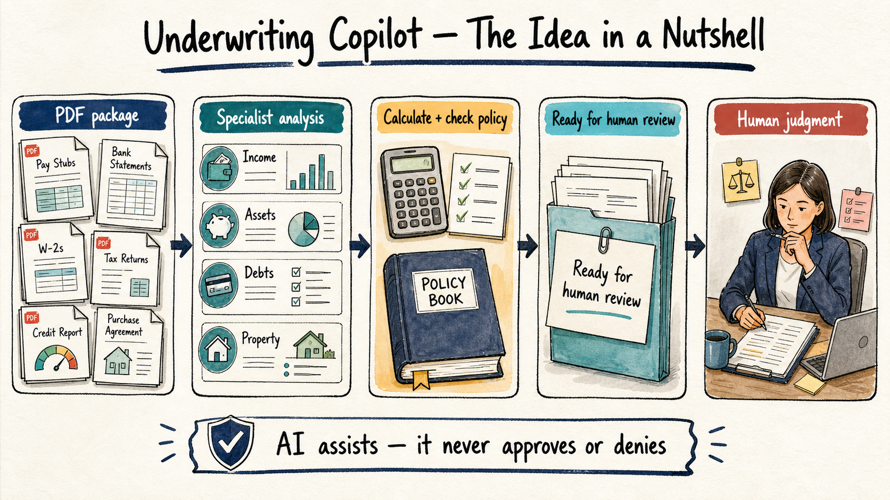
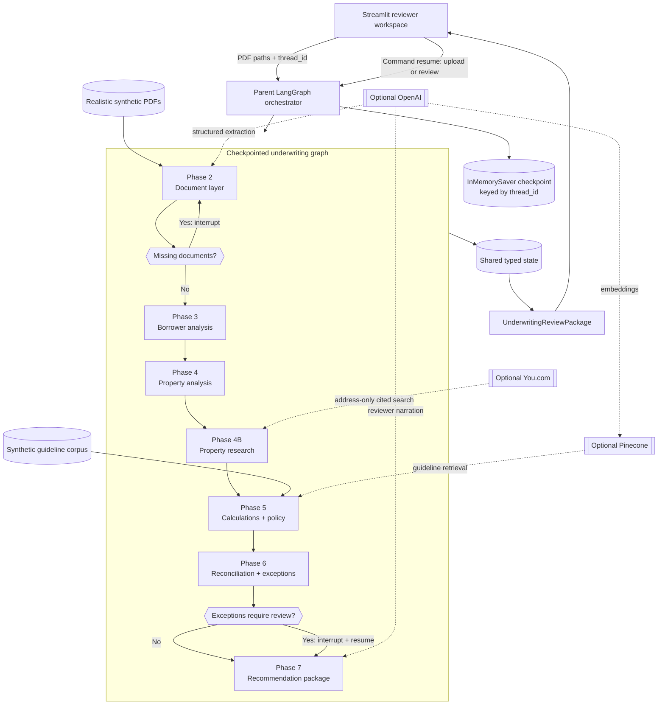
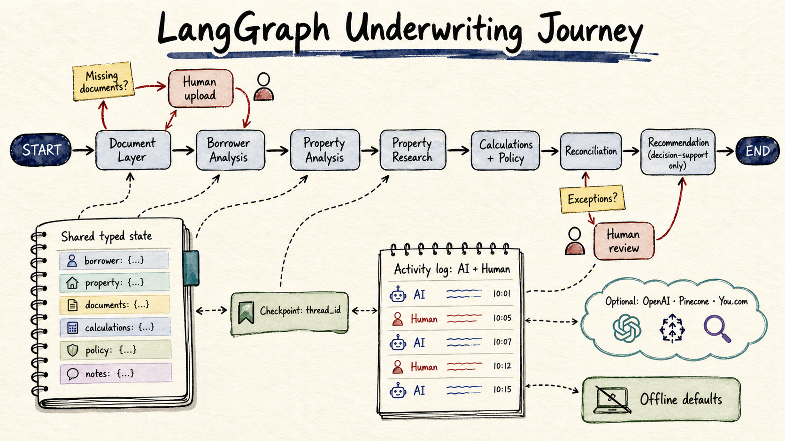

# Mortgage Underwriting Copilot — Product Requirements

## Product intent

Build a human-in-the-loop mortgage underwriting copilot that verifies borrower
and property evidence, calculates qualification metrics, retrieves applicable
guidelines, identifies discrepancies, and prepares a traceable recommendation
for a qualified underwriter.

The system is decision support. It must never autonomously approve or deny a
loan. All bundled documents and records are synthetic.

## Implemented scope

- Purchase mortgages with salaried, self-employed, and mixed-income paths.
- Searchable-PDF intake, classification, structured extraction, and document
  requirement checks.
- Income, asset, liability, purchase-contract, and appraisal analysis.
- Deterministic DTI and LTV calculations.
- Local guideline retrieval with hashing embeddings, or optional persistent
  Pinecone retrieval with OpenAI embeddings.
- Optional address-only property research through You.com with citations.
- Canonical fact reconciliation, standardized exceptions, proposed conditions,
  and evidence provenance.
- LangGraph checkpointing and interrupts for missing documents and exception
  review.
- Streamlit reviewer UI with package inventory, recommendation, evidence,
  policy, property research, and an AI-versus-human activity log.

Out of scope: autonomous lending decisions, live credit bureau or AUS access,
fraud detection, title/insurance/closing workflows, real lender policies, and
using web estimates as an appraisal replacement.

## The idea in a nutshell



A document package enters the workspace, bounded specialists turn it into
structured evidence, deterministic services calculate ratios and check
guidelines, and the application prepares a recommendation for human judgment.
The copilot assists throughout the review; it never owns the lending decision.

## Detailed architecture

The application uses a layered architecture so the UI, workflow, domain rules,
and optional network services can evolve independently.



### Architectural layers

| Layer | Responsibility | Main implementation |
|---|---|---|
| Presentation | Package selection, upload inventory, interrupt forms, recommendation and audit views | `streamlit_app.py`, `ui_support.py` |
| Orchestration | Phase composition, routing, checkpointing, interrupt and resume behavior | `orchestrator.py` |
| Specialist subgraphs | Document, borrower, collateral, research, calculation, policy, reconciliation, and summary tasks | Phase modules under `src/underwriting_agent/` |
| Domain contracts | Pydantic validation plus LangGraph state shapes | `models.py` |
| Deterministic services | Classification fallback, income and debt logic, DTI/LTV, rules, exceptions, evidence reconciliation | Phase modules and `calculations_policy.py` |
| Optional adapters | OpenAI, Pinecone, and You.com implementations selected from server-side flags | `integrations.py`, `model_services.py`, `property_research.py` |
| Data | Realistic PDF packages, manifest, regression fixtures, and guideline corpus | `data/` |
| Observability | Actor-attributed AI and human workflow events | `observability.py` and `WorkflowEvent` |

### Design principles

1. **Typed boundaries:** each phase reads and writes validated domain objects,
   avoiding hidden contracts in model prose.
2. **Deterministic authority:** models may extract or narrate, but Python owns
   ratios, rule evaluation, exception creation, and routing.
3. **Evidence before prose:** canonical facts retain document IDs, policy
   findings retain rule IDs, and web findings retain URLs.
4. **Human control:** missing evidence and material exceptions pause execution;
   the human response becomes part of the final package.
5. **Offline first:** local extraction, hashing embeddings, deterministic
   narration, and synthetic data keep development and tests reproducible.
6. **Replaceable integrations:** injected service interfaces allow optional
   providers without changing downstream state contracts.

## LangGraph model



### Parent graph and subgraphs

`build_underwriting_orchestrator()` creates the parent `StateGraph`. Each phase
is itself a compiled subgraph, but the parent owns cross-phase ordering and
human-review policy. This keeps each specialist testable in isolation while the
orchestrator controls the complete lifecycle.

```text
START
  → document_layer
  → route_after_documents
      ├─ complete ───────────────→ borrower_analysis
      └─ incomplete → request_missing_documents ─→ document_layer
  → property_analysis
  → property_research
  → calculations_and_policy
  → reconciliation
  → route_after_reconciliation
      ├─ no review ──────────────→ underwriting_summary
      └─ review → exception_review → underwriting_summary
  → END
```

### Shared state model

`UnderwritingState` is an incrementally enriched `TypedDict`. Pydantic models
validate the durable objects placed inside it.

```text
UnderwritingState
├── identity/input: loan_id, document_paths
├── Phase 2: intake_documents, parsed_documents, requirements
├── Phase 3: borrower_path, income_analysis, asset_analysis,
│            liability_analysis
├── Phase 4/4B: property_analysis, property_research
├── Phase 5: calculations, retrieved_rules
├── Phase 6: canonical_facts, exceptions, conditions,
│            human_review_items
├── human control: human_review, workflow_status
├── audit: observability_events
└── Phase 7: review_package
```

Nodes return partial state updates instead of mutating a global object. The
same state contract flows through local services and optional provider-backed
services, preventing an integration from changing downstream expectations.

### Conditional routing and interrupts

- After Phase 2, `requirements.complete` selects normal borrower analysis or a
  missing-document interrupt.
- `request_missing_documents` calls LangGraph `interrupt()`. A resume payload
  supplies additional `document_paths`, records a human upload event, and loops
  through document intake again.
- After Phase 6, the workflow either proceeds directly to the summary or pauses
  at `exception_review`.
- The exception resume payload contains the reviewer action, reviewer name, and
  notes. It is captured as human input, not treated as a credit decision.
- Every invocation and resume uses the same configurable `thread_id`, allowing
  the checkpointer to restore the correct graph state.

### Observability flow

Each phase appends a `WorkflowEvent` with `actor`, `phase`, `action`, `details`,
UTC timestamp, and optional metadata. Automated phase work is marked `ai`;
uploads and exception responses are marked `human`. Phase 7 copies the complete
event sequence into `UnderwritingReviewPackage.observability_log`, which powers
the Streamlit Activity log.

### Service injection model

The parent graph accepts four optional dependencies:

| Dependency | Phase | Role | Offline behavior |
|---|---|---|---|
| `document_interpreter` | 2 | OpenAI structured classification and extraction | Deterministic interpreter |
| `property_research_service` | 4B | You.com address-only public research | Disabled result, no request |
| `guideline_store` | 5 | Pinecone with OpenAI embeddings | Local hashing vector store |
| `review_narrator` | 7 | OpenAI reviewer-facing prose | Deterministic summary |

`build_integrations_from_env()` constructs these adapters only when their
server-side feature flags and credentials enable them.

## Current workflow

```text
START
  → Phase 2: document intake, extraction, requirements
      └─ missing evidence → human upload interrupt → repeat Phase 2
  → Phase 3: borrower routing, income, assets, liabilities
  → Phase 4: contract and appraisal analysis
  → Phase 4B: optional address-only You.com research
  → Phase 5: deterministic calculations and guideline retrieval
  → Phase 6: reconciliation, exceptions, and conditions
      └─ review required → human exception-review interrupt
  → Phase 7: evidence-backed underwriting recommendation
  → END
```

Every phase appends attributable workflow events. Human uploads and review
responses are retained in the final package alongside AI actions.

## Shared typed state

Pydantic models in `src/underwriting_agent/models.py` define the stable
contracts. LangGraph `TypedDict` state carries intake documents, borrower and
property analyses, optional cited web research, calculations and policy rules,
canonical facts, exceptions, conditions, human review, workflow events, and the
final `UnderwritingReviewPackage`.

`review_disposition` is retained as an internal compatibility field, but the UI
and product language present it as a recommendation.

## Phase requirements

### Phase 2 — Document layer

Read PDFs, preserve source paths, classify document type, extract explicit
fields, and determine missing documents/evidence. The deterministic interpreter
is the offline default. Optional `OpenAIDocumentInterpreter` uses strict
Pydantic structured output behind the same `ParsedDocument` interface.

Primary inputs are the lender-style packages under `data/realistic_pdfs`,
resolved through manifest references `UW-26-0417-A`, `BRK-90831`, and
`WHL-77-2206`.

### Phase 3 — Borrower analysis

Route to salaried, self-employed, mixed, or unsupported income logic. Produce
typed income, asset, and liability analyses with source document IDs. Financial
selection and calculations remain deterministic.

### Phase 4 — Property analysis

Reconcile loan application, purchase contract, and appraisal values. Detect
low-appraisal or property discrepancies. Downstream LTV uses the lower of
purchase price and appraised value.

### Phase 4B — Property web research

When `USE_PROPERTY_WEB_RESEARCH=true`, send only the normalized property
address to You.com's Web Search API. Retain URLs, excerpts, retrieval times,
observations, warnings, and discrepancies. Never send borrower identity,
financial facts, credit data, documents, or loan identifiers. Web findings are
unverified reviewer context: they do not replace the appraisal or change LTV.

### Phase 5 — Calculations and policy

Calculate DTI and LTV in Python. Retrieve relevant synthetic guideline rules
with stable IDs and metadata. The offline backend uses 256-dimensional hashing
embeddings. The optional Pinecone backend uses OpenAI embeddings and persistent
similarity search. Retrieval does not enforce policy or generate a decision.

### Phase 6 — Reconciliation and exceptions

Create canonical facts, retain provenance, combine specialist and web-research
discrepancies, deduplicate exception codes, attach relevant rule IDs, and
propose conditions for human review.

### Phase 7 — Recommendation package

Return executive summary, reviewer focus, key facts, rule IDs, exceptions,
conditions, optional external research, captured human review, and the complete
observability log. Optional model narration may restate verified facts but may
not invent evidence, calculate ratios, or decide the loan.

## Human-in-the-loop and observability

The parent orchestrator uses a checkpointer keyed by `thread_id` and pauses for
missing-document upload and exception review. Human acknowledgements or change
requests are recorded in the final package. Each activity record contains its
phase, action, details, timestamp, metadata, and actor (`ai` or `human`). The
current implementation uses `InMemorySaver`; SQLite is intentionally omitted.

## Streamlit experience

The reviewer can select a realistic sample package or upload PDFs. Before
analysis, the UI lists every selected document. It guides the reviewer through
interrupts and displays an underwriting recommendation with Overview,
Documents, Exceptions, Property research, Policy & evidence, and Activity log
views. Credentials and environment switches remain server-side. There is no
raw JSON tab.

## Data strategy

- `data/realistic_pdfs/`: primary notebook, CLI, and UI inputs; varied layouts
  and filenames with no exposed gold-results file.
- `data/pdfs/LOAN-*` plus JSONL files: curated eight-scenario regression suite
  with `expected_results.jsonl`; not the primary application input.
- `data/underwriting_guidelines.jsonl`: synthetic guideline corpus.

No dataset represents a real borrower, employer, account, property, or credit
file.

## Configuration and service boundaries

Secrets and flags are loaded from `.env`; `.env.example` documents supported
keys. Optional seams are OpenAI document interpretation, Pinecone plus OpenAI
embedding retrieval, OpenAI narration, and You.com property research. All are
disabled by default so notebooks and tests run offline.

## Technical stack

- Python 3.12+, LangGraph, LangChain, Pydantic 2, pypdf, and Streamlit.
- Optional OpenAI, Pinecone, and You.com services.
- pytest for automated verification.

## Acceptance criteria

- Notebooks demonstrate `data/realistic_pdfs` and execute offline.
- Curated `LOAN-*` fixtures are limited to regression examples and tests.
- DTI/LTV and policy enforcement remain deterministic and testable.
- Significant facts and exceptions retain source or rule provenance.
- Missing documents and exceptions trigger resumable human review.
- Human responses appear in the final recommendation and activity log.
- Web research contains citations and cannot override appraisal facts.
- The UI displays uploaded documents and exposes neither secrets nor raw JSON.
- Automated tests and representative CLI runs pass.

## Suggested production steps

- Replace `InMemorySaver` with an approved durable checkpointer.
- Add OCR and page/field-level citations for scanned or inconsistent PDFs.
- Add authentication, role-based access, encryption, retention controls, and
  redaction before use with regulated data.
- Add provider retry/rate-limit handling and end-to-end tracing.
- Evaluate extraction, retrieval, routing, calculations, escalation, and
  unsupported-fact rates against a governed test set.
